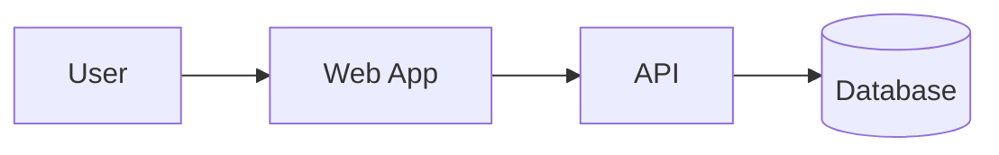

---
meta:
  name: "Project X — Proposal"
  client: "Acme Corp"
  date: "2026-04-18"
  author: "Tetra Data Teknologi"
  version: "1.0"
  confidential: true
  subtitle: "Internal platform modernization"
logos: []
toc:
  enabled: true
  depth: 3
  title: "Table of Contents"
numbering:
  enabled: true
  format: "1.1.1"
  max_level: 4
footer:
  enabled: true
  page_numbers: true
  text: "Project X Proposal"
---

# Executive Summary

Project X delivers a modern **internal platform** replacing three legacy tools. Key outcomes:

- Reduce manual workflows by 60%.
- Ship v1 within the next *four* calendar months.
- Align with the client's existing cloud landing zone.

> "A credible bid pack, shipped fast." — our guiding principle for this engagement.

---

# Scope of Work

We will deliver the following outcomes in three phases.

## In Scope

- Core data model and REST API
- Admin web UI with `SSO` integration
- Audit logging and observability dashboards

## Out of Scope

- Native mobile apps
- Legacy data migration beyond the last 12 months

# Architecture

The high-level system flow is shown below.



## Technology Stack

| Layer | Technology | Notes |
| ----- | ----- | ----- |
| Backend | Go | Core API, orchestration |
| Frontend | Next.js | Web desktop + mobile web |
| Database | PostgreSQL | Primary store |
| Cache | Redis | Sessions, rate limits |

## Example configuration

```yaml
service:
  name: project-x-api
  replicas: 3
  resources:
    cpu: "500m"
    memory: "512Mi"
```

# References

The full timeline is provided in `{{ timeline_xlsx }}` and the priced quotation in `{{ quote_xlsx }}`.

See the [project-maker README](https://example.com) for orchestration details.
